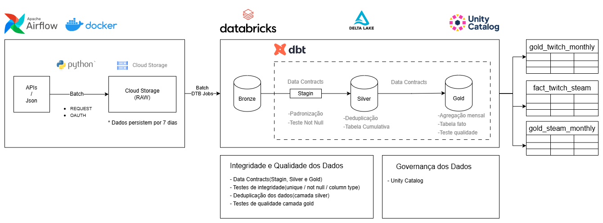

# Data Pipeline: Steam & Twitch Integration

Este projeto automatiza a extração e o processamento de métricas de engajamento de jogos, superando bloqueios de *scraping* (Cloudflare) através de integrações via APIs oficiais. O sistema alimenta um ecossistema de BI para análise de tendências de mercado.

## 🎯 Propósito e Solução
A extração via *webscraping* (SteamDB/TwitchTracker) era instável devido a bloqueios. Este pipeline soluciona o problema utilizando autenticação OAuth e requisições oficiais, garantindo **escalabilidade** e **integridade dos dados**.

---

## 🏗️ Arquitetura e Decisões Técnicas

### 1. Ingestão e Orquestração
* **Workflow:** Extrações via `HTTP/OAuth` a cada 10 minutos para o **Google Cloud Storage (GCS)**.
* **Orquestração:** **Airflow** e **Docker** gerenciam a captura; **Databricks Jobs** executa o processamento a cada 24h.
* **Eficiência:** A arquitetura separa a ingestão (frequente) do processamento (diário), minimizando o tempo de cluster Spark ativo.

### 2. Processamento Incremental e Performance
* **Cargas Incrementais:** Todas as tabelas do pipeline utilizam lógica de carga incremental. Isso evita o reprocessamento de dados históricos, reduzindo drasticamente o esforço computacional e o tempo de execução.
* **Estratégia de Persistência:** Os arquivos JSON brutos permanecem por apenas 7 dias na Landing Zone (GCS) para otimizar custos.
* **Otimização Delta:** A conversão de arquivos esparsos para tabelas **Delta** gerou uma **redução de 83% no custo de armazenamento**.

### 3. Camadas de Dados (Medallion Architecture)

| Camada | Processamento | Objetivo |
| :--- | :--- | :--- |
| **Bronze** | Ingestão Incremental | Compactação de JSONs brutos em tabelas Delta com validação de schema. |
| **Silver** | Limpeza e Modelagem | Deduplicação, tipagem e normalização dos dados das APIs. |
| **Gold** | Agregação de Negócio | Tabelas Fato mensais (`fact_twitch_monthly`) otimizadas para dashboards e KPIs. |

### 4. Qualidade e Governança
* **Data Contracts:** Testes de integridade via **dbt** (`unique`, `not_null`) e validação de tipos na camada Silver e Gold.
* **Segurança:** Implementação de **GCP IAM** com princípio de "menor privilégio" para *Service Accounts*.
* **Linhagem:** Uso de **Unity Catalog** para rastreabilidade de dados (*Lineage*) e catálogo de metadados centralizado.

---
> **Nota:** Este projeto opera em conformidade com os termos de uso das APIs oficiais da Steam e Twitch. Os dados são utilizados estritamente para fins de análise.